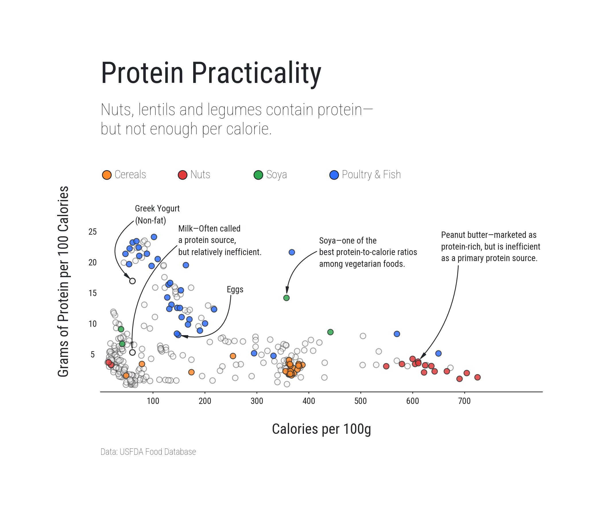

# Protein Density vs Protein Perception

> **India is protein deficient — but more importantly, protein misinformed.**

This project uses data to challenge a common nutritional misconception:  
many foods widely perceived as “good protein sources” are actually **poor primary protein providers when evaluated on protein density** (protein per 100 calories).

The goal is not to label foods as *good* or *bad*, but to **separate nutritional role from nutritional efficiency**.

---

## Data Viz

---

## 📌 Motivation

India faces a well-documented protein intake gap, yet dietary discussions often focus on *what contains protein* rather than *how efficiently protein is delivered*.

This project asks a simple but critical question:

> **How much protein do you really get for every 100 calories you consume?**

When protein density is used as the lens, popular assumptions begin to break down.

---

## 🧠 Core Idea

- **Protein content alone is misleading**
- **Protein density (protein per 100 kcal)** is a more practical metric
- Many staple foods require **excessive caloric intake** to deliver meaningful protein
- A smaller set of foods provide **high protein with relatively low calorie cost**

This distinction is crucial for:
- Protein adequacy
- Weight management
- Dietary planning at scale

---

## 📊 Metric Used

### Protein Density

Protein Density = (Protein per 100g ÷ Calories per 100g) × 100

This answers:
> *“How much protein do I get if I consume 100 calories of this food?”*
---

## 🧩 Food Grouping Logic

Foods are grouped to highlight **nutritional role vs protein efficiency**:

- **Poultry & Fish**  
- **Cereals** (Rice, Wheat, Millets, Oats)  
- **Nuts & Seeds**  
- **Soya & High-Protein Plant Sources**  
- **Others** (shown in neutral grey)

This grouping helps visually separate:
- Staple foods  
- Calorie-dense foods  
- High-efficiency protein sources  

---

## 🎯 Key Insights

- Lentils, chickpeas, rajma, and nuts **contain protein**, but are **calorie-inefficient** as primary protein sources
- High-protein perception ≠ high protein delivery
- Protein adequacy cannot be solved by awareness alone — **measurement matters**
- The Indian diet needs a **protein density lens**, not protein labeling

---

## 🛠️ Tools & Stack

- Python    
- Matplotlib (custom styling & annotations)  
- Nutrition data (USFDA public food composition datasets)

---

## ✍️ Author

**Debatreyo Roy**  
Data Analyst | Data Storytelling | Visualization  
📍 India

---
